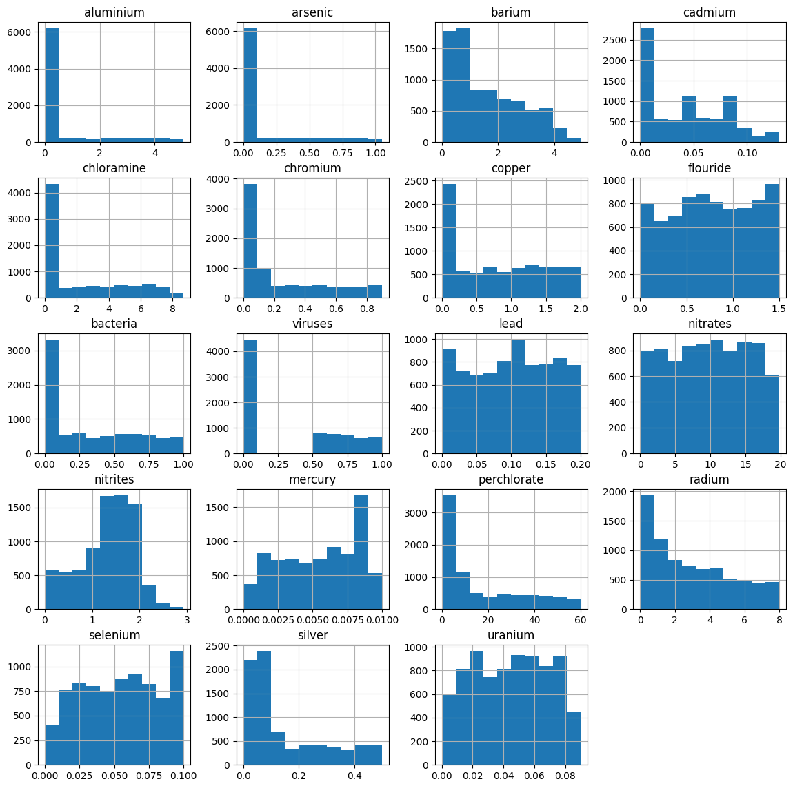
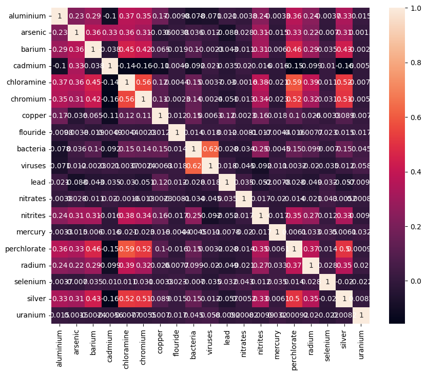
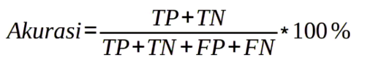
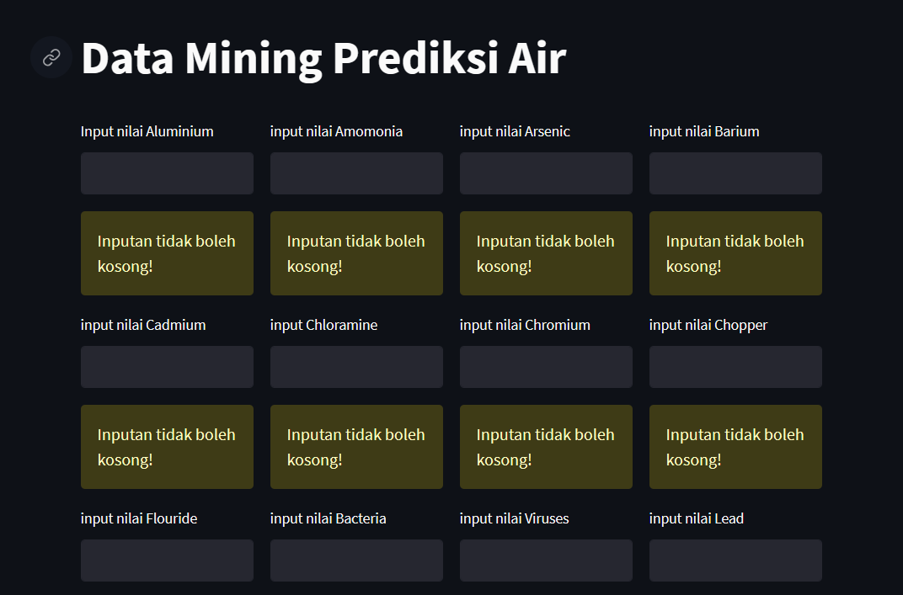

# Laporan Proyek Machine Learning

### Nama : Muhammad Rafif Musyaffa

### Nim : 211351097

### Kelas : Pagi A

## Domain Proyek

Air adalah kebutuhan yang paling penting bagi kehidupan manusia.Kualitas air merupakan faktor penting yang harus diperhatikan, baik untuk konsumsi manusia maupun untuk menjaga keseimbangan ekosistem. Kualitas air dapat dipengaruhi oleh berbagai faktor seperti polusi, perubahan iklim, aktivitas manusia, dan kondisi alam sekitar.Pemantauan dan pengelolaan kualitas air penting untuk menjaga kesehatan manusia, kelestarian lingkungan, dan kelestarian sumber daya air.Dalam upaya ini, teknologi dan metode analisis terus berkembang untuk memantau dan memprediksi kualitas air dengan lebih akurat.Prakiraan kualitas air dapat membantu mengambil keputusan yang lebih baik mengenai pengelolaan sumber daya air, mengurangi polusi, dan melindungi ekosistem perairan.Dengan memahami faktor-faktor yang mempengaruhi kualitas air dan menggunakan model peramalan yang tepat, kita dapat mengambil langkah-langkah yang diperlukan untuk mempertahankan dan meningkatkan kualitas air di masa depan.

## Business Understanding

Memanfaatkan data mining guna memprediksi apakah kualitas air itu baik atau buruk. Informasi ini dapat digunakan untuk penyuluhan kesehatan, pencegahan, dan perawatan.

### Problem Statements

- Bagaimana cara mengidentifikasi dan mengatasi polusi air yang mengancam kualitas air minum?
- Bagaimana mengukur dan memantau kualitas air secara efektif untuk mengidentifikasi potensi ancaman terhadap ekosistem air?
- Bagaimana meningkatkan kesadaran masyarakat tentang pentingnya menjaga kualitas air dan mendorong praktik yang bertanggung jawab terhadap pengelolaan sumber daya air?

### Goals

- Meningkatkan pemantauan dan prediksi kualitas air: Tujuan ini mencakup pengembangan sistem pemantauan yang efektif dan teknologi prediksi yang dapat membantu dalam mengidentifikasi perubahan kualitas air secara dini.
- Mempertahankan keberlanjutan ekosistem perairan: Tujuan ini bertujuan untuk menjaga ekosistem air yang sehat dan beragam. Hal ini melibatkan upaya untuk mengurangi pencemaran air, memantau kualitas air secara teratur, dan melindungi habitat alami serta keanekaragaman hayati yang ada di perairan
- Meningkatkan kesadaran dan partisipasi masyarakat: Tujuan ini bertujuan untuk meningkatkan pemahaman dan kesadaran masyarakat tentang pentingnya menjaga kualitas air. Hal ini melibatkan edukasi tentang praktik yang bertanggung jawab terhadap pengelolaan air, penggunaan yang efisien, dan perlindungan sumber daya air

  ### Solution statements

  - Menerapkan sistem pengolahan air yang efektif: Menggunakan teknologi dan metode pengolahan air yang efisien dan efektif untuk menghilangkan kontaminan dan memastikan air yang dihasilkan memenuhi standar kualitas yang ditetapkan.
  - Meningkatkan pemantauan dan prediksi kualitas air: Mengembangkan dan menerapkan sistem pemantauan yang canggih dan teknologi prediksi untuk mendeteksi perubahan dalam kualitas air dengan cepat dan mengambil tindakan yang diperlukan.

## Data Understanding

Untuk Proyek ini saya menggunakan data yang berasalah dari kaggle.Dataset ini memiliki 21 Atribut yang sesui dengan proyek.

Dataset yang digunakan: [Water Quality Prediction Dataset](https://www.kaggle.com/datasets/mssmartypants/water-quality).

### Variabel-variabel pada Water quailty Prediction Dataset adalah sebagai berikut:

| Nomer | Variabel    | Tipe Data | Keterangan                                                                 |
| ----- | ----------- | :-------: | -------------------------------------------------------------------------- |
| 1     | aluminium   |   Float   | Kadar aluminum berbahaya jika lebih besar dari 2.8                         |
| 2     | ammonia     |   Float   | Kadar ammonia berbahaya jika lebih besar dari 32.5                         |
| 3     | arsenic     |   Float   | Kadar arsenic berbahaya jika lebih besar dari 0.01                         |
| 4     | barium      |   Float   | Kadar barium berbahaya jika lebih besar dari 2                             |
| 5     | cadmium     |   Float   | Kadar cadmium berbahaya jika lebih besar dari 0.005                        |
| 6     | chloramine  |   Float   | Kadar chloromine berbahaya jika lebih besar dari 4                         |
| 7     | chromium    |   Float   | Kadar chormium berbahaya jika lebih besar dari 0.1                         |
| 8     | copper      |   Float   | Kadar copper berbahaya jika lebih besar dari 1.3                           |
| 9     | flouride    |   Float   | Kadar flouride berbahaya jika lebih besar dari 1.5                         |
| 10    | bacteria    |   Float   | Kadar bacteria berbahaya jika lebih besar dari 0                           |
| 11    | bacteria    |   Float   | Kadar bacteria berbahaya jika lebih besar dari 0                           |
| 12    | lead        |   Float   | Kadar lead berbahaya jika lebih besar dari 0.015                           |
| 13    | nitrates    |   Float   | Kadar nitrates berbahaya jika lebih besar dari 10                          |
| 14    | nitrites    |   Float   | Kadar nitrites berbahaya jika lebih besar dari 1                           |
| 15    | mercury     |   Float   | Kadar mercury berbahaya jika lebih besar dari 0.002                        |
| 16    | perchlorate |   Float   | Kadar perchlorate berbahaya jika lebih besar dari 56                       |
| 17    | radium      |   Float   | Kadar radium berbahaya jika lebih besar dari 5                             |
| 18    | selenium    |   Float   | Kadar selenium berbahaya jika lebih besar dari 0.5                         |
| 19    | silver      |   Float   | Kadar silver berbahaya jika lebih besar dari 0.1                           |
| 20    | uranium     |   Float   | Kadar uranium berbahaya jika lebih besar dari 0.3                          |
| 21    | is_safe     |   Float   | Status kualitas air <br>0 : Kualitas Air buruk, <br>1 : Kualitas air baik. |

**Rubrik/Kriteria Tambahan (Opsional)**:

- Visualisai Data
  
  

## Data Preparation

Beberapa penggunaan algoritma logistik regresi yang saya gunakan untuk prediksi Kualitas Air, teknik persiapan data mencakup langkah-langkah yang saya lakukan ialah :

1. Mencari dataset yang berisi informasi beberapa kandungan yang terdapat dalam kandungan air.
2. Mendownload dataset yang sudah dicari dan menload dataset yang akan digunakan.
3. Memilih library yangrelevan untuk prediksi kualitas air.

```python
  import numpy as np
  import pandas as pd
  import seaborn as sns
  import matplotlib.pyplot as plt
  from sklearn.preprocessing import StandardScaler
  from sklearn.model_selection import train_test_split
  from sklearn import svm
  from sklearn.metrics import accuracy_score
  import pickle
```

4. Mengecek dan menghapus dataset yang bernilai null

```python
  //Mengecek nilai null
  cek_nilai_hilang = df.isnull().any().any()

  if cek_nilai_hilang:
    print("The dataset has missing values.")
  else:
    print("The dataset has no missing values.")
```

```python
  //Menghapus nilai nul
  df = df[~df.applymap(lambda x: x == '#NUM!').any(axis=1)]
```

5. Memisahkan data dan label
6. Mengstandarisasi data
7. Memisahkan dataset menjadi dua bagian, yaitu data pelatihan (training data) dan data pengujian (testing data) untuk mengukur kinerja model.
8. Membuat data latih menggunakan algoritma SVM.
9. Mengevaluasi data menggunakan data pengujian untuk mengukur kinerja model menggunakan metrik akurasi.
10. Mencoba model prediksi untuk mengecek hasilnya sesuai atau tidak.
    Pengeimplementasian model, setelah semuanya sesuai dan dievaluasi dengan baik, kita dapat menggunakannya untuk memprediksi kualitas air pada data baru.
11. Terakhir export model menggunakan library pickle.

```python
import pickle
filename = 'water_model.sav'
pickle.dump(classifier, open(filename,'wb'))
```

## Modeling

Model yang diguanakan dalam kesempatan kali ini saya menggunakan model SVM(Support Vector Machine). Kernel: SVM juga mendukung penggunaan kernel untuk menangani masalah klasifikasi non-linear. Kernel memungkinkan SVM untuk memetakan data ke dalam ruang fitur yang memiliki struktur non-linear, sehingga memungkinkan pemisahan kelas yang lebih kompleks.

```python
    classifier = svm.SVC(kernel='linear')
    classifier.fit(X_train, Y_train)
```

- Kelebihan SVM:
  - Efektif dalam Ruang Fitur yang Tinggi: SVM efektif dalam mengatasi masalah klasifikasi dengan jumlah fitur yang tinggi. Dalam ruang fitur yang tinggi, SVM dapat memisahkan kelas dengan menggunakan hyperplane yang optimal.
  - Kemampuan Mengatasi Masalah Klasifikasi Non-linear: SVM dapat mengatasi masalah klasifikasi non-linear dengan menggunakan kernel. Kernel memungkinkan SVM untuk memetakan data ke dalam ruang fitur yang memiliki struktur non-linear, sehingga memungkinkan pemisahan kelas yang lebih kompleks.
  - Resisten terhadap Overfitting: SVM memiliki kemampuan yang baik dalam mengatasi masalah overfitting. Dengan menggunakan margin maksimal, SVM cenderung menghasilkan model yang memiliki generalisasi yang baik pada data yang belum pernah dilihat sebelumnya.
  - Dukungan untuk Data yang Tidak Seimbang: SVM dapat menangani data yang tidak seimbang dengan baik. Dalam SVM, kita dapat memberikan bobot yang berbeda pada setiap sampel, sehingga memungkinkan SVM untuk lebih memperhatikan kelas minoritas dan mengurangi bias yang mungkin terjadi.
  - Keandalan Terhadap Noise: SVM cenderung memiliki keandalan yang tinggi terhadap noise dalam data. Hal ini karena SVM berfokus pada margin maksimal, yang memungkinkan SVM untuk mengabaikan beberapa data yang mungkin menjadi noise.
- Kekurangan SVM:
  - Sensitivitas terhadap Parameter: SVM memiliki beberapa parameter yang perlu diatur dengan benar, seperti parameter C dan gamma. Pemilihan parameter yang tidak tepat dapat menghasilkan model yang tidak optimal atau bahkan buruk.
  - Kompleksitas Komputasional: SVM memiliki kompleksitas komputasional yang tinggi, terutama jika jumlah sampel dan fitur dalam dataset sangat besar. Pelatihan SVM dapat memakan waktu yang lama dan membutuhkan sumber daya komputasi yang cukup besar.
  - Tidak Efisien untuk Data Skala Besar: SVM tidak efisien untuk dataset dengan jumlah sampel yang sangat besar. Jika dataset memiliki jutaan sampel, SVM mungkin tidak praktis untuk digunakan karena waktu dan sumber daya yang dibutuhkan.
  - Tidak Mendukung Langsung untuk Data Multikelas: SVM awalnya dirancang untuk masalah klasifikasi biner. Meskipun ada variasi SVM yang mendukung klasifikasi multikelas, seperti One-vs-One dan One-vs-Rest, implementasinya bisa lebih rumit dan memerlukan lebih banyak sumber daya.

## Evaluation

Akurasi adalah ukuran seberapa baik sebuah sistem atau model dalam melakukan klasifikasi atau prediksi dengan membandingkan hasil yang dihasilkan, dengan hasil yang sebenarnya.
Akurasi sering digunakan dalam konteks klasifikasi biner, di mana model harus memprediksi apakah suatu data masukan termasuk dalam kelas positif atau negatif 1.

Untuk menghitung akurasi, kita dapat menggunakan rumus berikut:


## Deployment

Link Streamlit : [Streamlit Prediksi Kualitas Air](https://prediksi-air.streamlit.app/)

